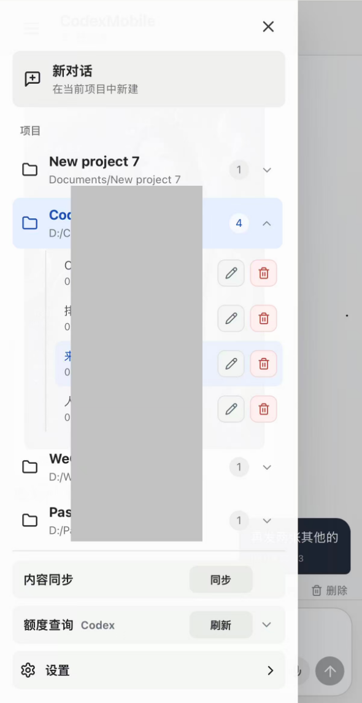
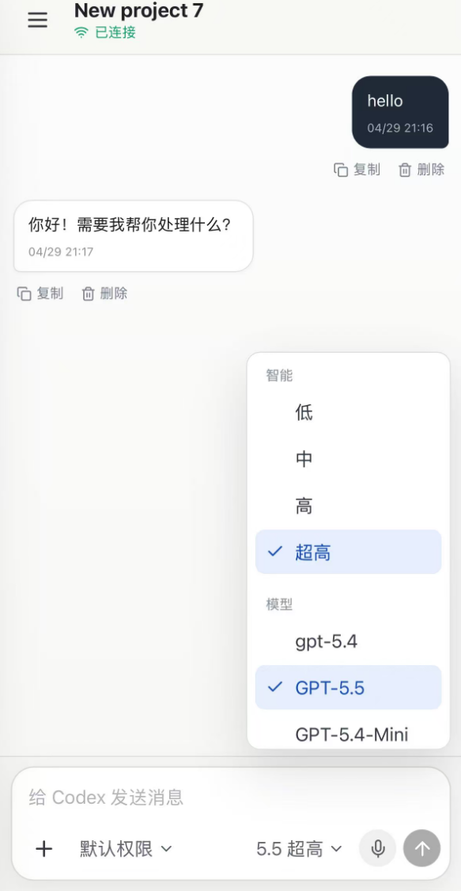

# CodexMobile

CodexMobile 是一个面向 iPhone 的 Codex PWA 客户端。它在电脑上启动一个轻量本地桥接服务，通过 Tailscale、局域网或其它私有网络，让手机可以访问并使用这台电脑上的 Codex 项目、会话和模型能力。

这个项目适合个人使用：你可以在 iPhone 主屏像 App 一样打开它，切换 Codex 项目、查看线程、发送文字或语音消息、上传文件，并在手机上接收 Codex 的实时回复和执行状态。

> 本项目不是公网 SaaS、多人控制台或远程桌面工具。建议只在可信私有网络中使用。

## 界面演示

| 项目抽屉 | 对话与模型选择 |
| --- | --- |
|  |  |

## 功能特性

- iPhone 优先的 PWA 界面，可添加到 iOS 主屏
- 读取本机 Codex 项目和会话，支持项目切换、线程展开、重命名和删除
- 新建对话、续聊已有线程，并通过 WebSocket 显示实时状态
- 支持权限模式、模型选择和推理强度选择
- 支持图片/文件上传，文件保存在本机并将路径交给 Codex 使用
- 支持语音输入：前端录音，后端转写后自动发送给 Codex
- 支持本地 SenseVoice/FunASR 中文语音识别服务
- 支持生成图片并在移动端展示
- 支持 CLIProxyAPI Codex 额度查询
- 支持浅色/深色主题
- 支持一次性配对码和本机设备 token，适合私有网络访问

## 架构

```text
iPhone PWA
  |
  | HTTPS / WebSocket，建议走 Tailscale 或局域网
  v
CodexMobile Node.js 服务
  |-- 读取 ~/.codex/config.toml
  |-- 读取 ~/.codex/sessions
  |-- 调用 @openai/codex-sdk 发送和续聊
  |-- 调用 OpenAI 兼容接口生成图片
  |-- 调用本地 SenseVoice ASR 或 OpenAI 兼容转写接口
  |-- 可选调用 CLIProxyAPI 管理接口查询 Codex 额度
```

## 环境要求

- Node.js 20+
- npm
- 已配置好的本机 Codex 环境，默认读取 `~/.codex`
- 手机和电脑在同一私有网络中，例如 Tailscale 或局域网
- 可选：Docker Desktop，用于本地 SenseVoice 语音识别
- 可选：CLIProxyAPI，用于 OpenAI 兼容路由、图片生成或额度查询

## 快速开始

```powershell
git clone https://github.com/2449796202qq-arch/CodexMobile.git
cd CodexMobile
npm install
npm run build
npm start
```

启动后在电脑浏览器打开：

```text
http://127.0.0.1:3321
```

手机访问时，建议先把电脑和 iPhone 接入 Tailscale 或同一个局域网，然后打开：

```text
http://<电脑的私网 IP>:3321
```

第一次进入需要输入服务启动时打印的 6 位配对码。配对成功后，浏览器会保存设备 token，后续不需要每次重新输入。

## HTTPS 与 iOS 语音权限

iOS Safari / PWA 通常要求 HTTPS 才能稳定使用麦克风。你可以使用自己的证书、反向代理，或 Tailscale Serve 暴露 HTTPS 地址。

示例：

```powershell
$env:CODEXMOBILE_PUBLIC_URL="https://<your-device>.<your-tailnet>.ts.net:3443/"
npm run start:env
```

如果你使用自签名证书，可以通过环境变量指定：

```powershell
$env:HTTPS_PFX_PATH="C:\path\to\server.pfx"
$env:HTTPS_PFX_PASSPHRASE="change-me"
$env:HTTPS_ROOT_CA_PATH="C:\path\to\root-ca.cer"
npm run start:env
```

## 配置

复制示例配置：

```powershell
Copy-Item .env.example .env
npm run start:env
```

常用配置项：

- `HOST`：服务监听地址，默认 `0.0.0.0`
- `PORT`：HTTP 端口，默认 `3321`
- `HTTPS_PORT`：HTTPS 端口，默认 `3443`
- `CODEXMOBILE_PUBLIC_URL`：手机访问用的公开私网地址
- `CODEXMOBILE_PAIRING_CODE`：可选固定 6 位配对码；不设置则启动时随机生成
- `CODEX_HOME`：Codex 配置目录，默认 `~/.codex`
- `CODEXMOBILE_HOME`：CodexMobile 本地状态目录，默认 `.codexmobile/state`
- `CLIPROXYAPI_CONFIG`：CLIProxyAPI 配置文件路径
- `CLIPROXYAPI_API_KEY` / `CLI_PROXY_API_KEY`：OpenAI 兼容接口密钥
- `CODEXMOBILE_CLIPROXY_MANAGEMENT_URL`：CLIProxyAPI 管理接口地址
- `CODEXMOBILE_CLIPROXY_MANAGEMENT_KEY`：CLIProxyAPI 管理密钥

不要提交 `.env`、`.codexmobile`、证书、日志、上传文件、生成图片或本地认证数据。

## 本地中文语音识别

CodexMobile 支持本地 SenseVoice/FunASR 语音识别。第一版默认使用 `iic/SenseVoiceSmall`，更适合中文、粤语、口音和短指令场景。

启动本地 ASR 服务：

```powershell
npm run asr:start
```

默认接口：

```text
http://127.0.0.1:8000/v1/audio/transcriptions
```

语音数据不会保存为聊天附件。服务端只在内存中处理上传音频；如果模型推理必须落临时文件，会在请求结束后立即删除。

相关配置：

- `CODEXMOBILE_LOCAL_TRANSCRIBE_BASE_URL`
- `CODEXMOBILE_TRANSCRIBE_MODEL`
- `CODEXMOBILE_ASR_DEVICE`
- `CODEXMOBILE_ASR_PORT`

## 图片生成

图片生成使用 OpenAI 兼容接口。你可以通过 CLIProxyAPI 或其它兼容服务提供图片模型。

相关配置：

- `CODEXMOBILE_IMAGE_BASE_URL`
- `CODEXMOBILE_IMAGE_API_KEY`
- `CODEXMOBILE_IMAGE_MODEL`
- `CODEXMOBILE_IMAGE_TIMEOUT_MS`

生成的图片默认保存到 `.codexmobile/generated`，不会进入 Git。

## CLIProxyAPI 额度查询

如果本机配置了 CLIProxyAPI 管理接口，CodexMobile 可以在 iPhone 抽屉中查询 Codex 额度。

相关配置：

- `CODEXMOBILE_CLIPROXY_MANAGEMENT_URL`
- `CODEXMOBILE_CLIPROXY_MANAGEMENT_KEY`
- `CLIPROXYAPI_CONFIG`

返回给前端的数据会脱敏，不会返回 access token 或完整密钥。

## 常用脚本

- `npm run build`：构建 PWA 到 `client/dist`
- `npm start`：启动 API、WebSocket 和构建后的 PWA
- `npm run start:env`：读取 `.env` 后启动
- `npm run start:bg`：后台启动服务，日志写入 `.codexmobile`
- `npm run asr:start`：构建并启动本地 SenseVoice ASR Docker 容器
- `npm run smoke`：检查本机 `/api/status`

## 私有网络部署建议

推荐方式：

1. 电脑和 iPhone 都安装 Tailscale。
2. 电脑启动 CodexMobile。
3. 使用 Tailscale IP 或 Tailscale Serve HTTPS 地址访问。
4. 第一次访问时输入配对码。
5. 在 iPhone Safari 中选择“添加到主屏幕”。

不建议直接把 CodexMobile 暴露到公网。

## 安全说明

- 配对 token 存储在 `.codexmobile/state`
- 上传文件和生成图片存储在 `.codexmobile`
- `.env.example` 只包含占位配置，不包含真实密钥
- `.gitignore` 已排除 `.env`、`.codexmobile`、证书、日志、构建产物和依赖目录
- CLIProxyAPI / OpenAI key 应通过环境变量或本地配置文件提供
- 本项目默认按单用户、私有网络场景设计

## License

MIT
